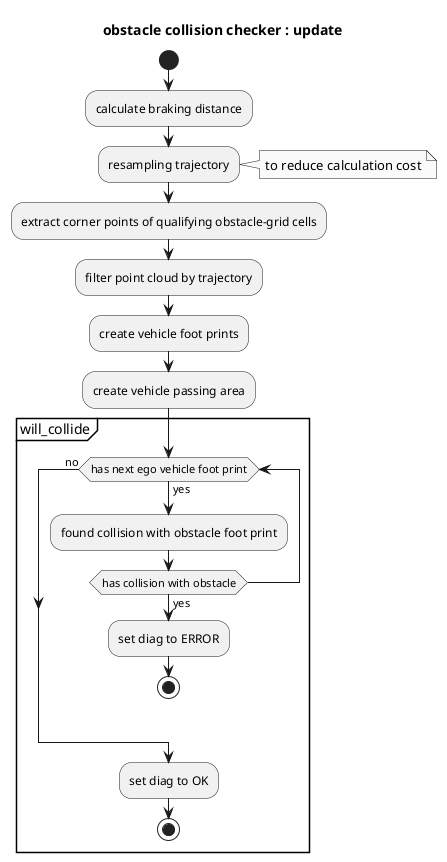

# obstacle_collision_checker

## Purpose

`obstacle_collision_checker` is a module to check obstacle collision for predicted trajectory and publish diagnostic errors if collision is found.

## Inner-workings / Algorithms

### Flow chart

### Algorithms

### Obstacle grid filtering

Obstacles are consumed from the sensing-side obstacle grid (`grid_map_msgs::msg::GridMap`, `base_link` frame) instead of a raw obstacle point cloud. On intake the grid is validated against the contract (frame is `base_link`, the `point_count` and `max_height` layers exist, the stamp is fresh within `obstacle_grid_timeout_sec`); a stale or contract-violating grid reads as **unavailable** and is reported as `ERROR`, never as "clear". Each grid cell qualifies with a purely 2D density gate (at least one point). The four corner points of every qualifying cell are emitted as a synthetic point cloud that feeds the unchanged corridor-membership check, keeping cell membership edge-conservative (a cell overlapping the footprint always contributes at least one corner inside it).

### Check data

Check that `obstacle_collision_checker` receives the obstacle grid, predicted_trajectory, reference trajectory, and current velocity data.

### Diagnostic update

If any collision is found on predicted path, this module sets `ERROR` level as diagnostic status else sets `OK`.

## Inputs / Outputs

### Input

| Name                                           | Type                                      | Description                                                         |
| ---------------------------------------------- | ----------------------------------------- | ------------------------------------------------------------------- |
| `~/input/reference_trajectory`                 | `autoware_planning_msgs::msg::Trajectory` | Reference trajectory                                                |
| `~/input/predicted_trajectory`                 | `autoware_planning_msgs::msg::Trajectory` | Predicted trajectory                                                |
| `/sensing/obstacle_segmentation/obstacle_grid` | `grid_map_msgs::msg::GridMap`             | Obstacle grid (base_link) from which occupied-cell corners are read |
| `/tf`                                          | `tf2_msgs::msg::TFMessage`                | TF                                                                  |
| `/tf_static`                                   | `tf2_msgs::msg::TFMessage`                | TF static                                                           |

### Output

| Name             | Type                                   | Description              |
| ---------------- | -------------------------------------- | ------------------------ |
| `~/debug/marker` | `visualization_msgs::msg::MarkerArray` | Marker for visualization |

## Parameters

| Name                        | Type     | Description                                                          | Default value |
| :-------------------------- | :------- | :------------------------------------------------------------------- | :------------ |
| `delay_time`                | `double` | Delay time of vehicle [s]                                            | 0.3           |
| `footprint_margin`          | `double` | Foot print margin [m]                                                | 0.0           |
| `max_deceleration`          | `double` | Max deceleration for ego vehicle to stop [m/s^2]                     | 2.0           |
| `resample_interval`         | `double` | Interval for resampling trajectory [m]                               | 0.3           |
| `search_radius`             | `double` | Search distance from trajectory to point cloud [m]                   | 5.0           |
| `obstacle_grid_timeout_sec` | `double` | Obstacle grid staleness timeout; older grids read as unavailable [s] | 0.5           |

## Assumptions / Known limits

To perform proper collision check, it is necessary to get a probable predicted trajectory and an obstacle grid without noise.

### Obstacle-grid height gate

The 2D density gate `{min_point_count_cell = 1, min_height = 0.0}` applies only a lower height floor of `0.0` in the `base_link` frame and no upper height band. This carries two assumptions relative to the legacy raw-cloud path, which used only the x/y coordinates and ignored z entirely:

- **Lower floor assumes `base_link` z = 0 sits at/near the ground**, so a standing obstacle reports `max_height > 0`. The floor drops not only sub-ground noise but also a real short obstacle whose entire top sits below the `base_link` horizontal plane (for example a low object on a steep downslope). Such a cell reports `max_height < 0`, does not qualify, and is missed — this is strictly less sensitive than the legacy z-agnostic path.
- **No upper band means the grid producer must height-crop before counting.** Any qualifying cell emits corner points regardless of how high its points are, so `point_count` is assumed to exclude overhead structures (gantries, signs, low branches). If the producer does not height-crop, an overhead-only cell becomes a phantom collision that a height-cropped legacy segmentation cloud would have avoided. Integrators should verify the producer height-crops the grid input.
