# Autoware Launch Architecture

This document describes the launch file hierarchy and ComposableNodeContainer relationships in Autoware Universe.

## 1. Launch File Hierarchy

### 1.1 Top-Level Overview

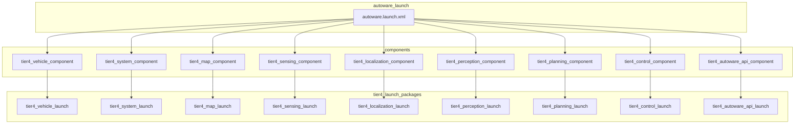

### 1.2 Perception Launch Hierarchy

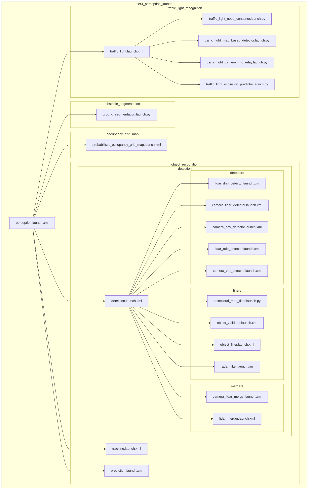

### 1.3 Localization Launch Hierarchy

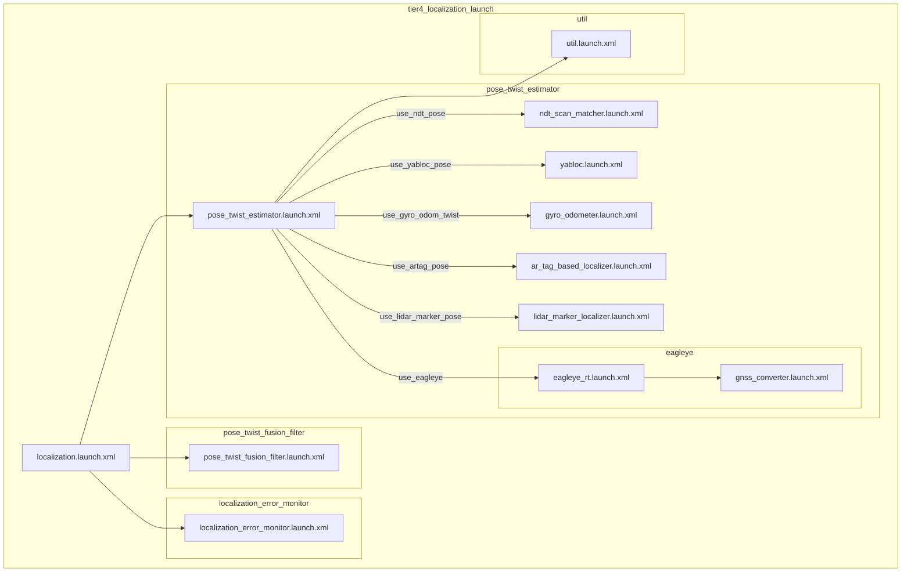

### 1.4 Sensing Launch Hierarchy

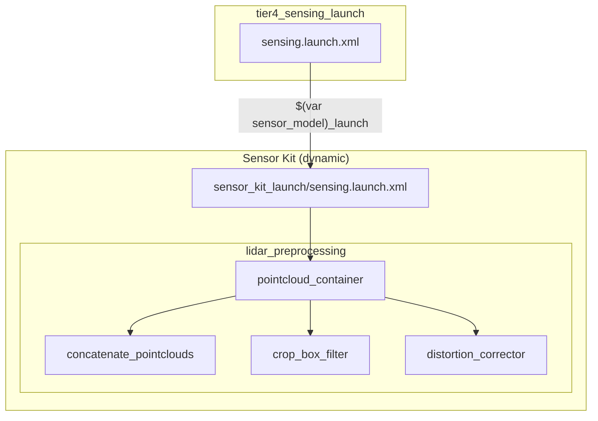

---

## 2. ComposableNodeContainer Relationships

### 2.1 Container Overview

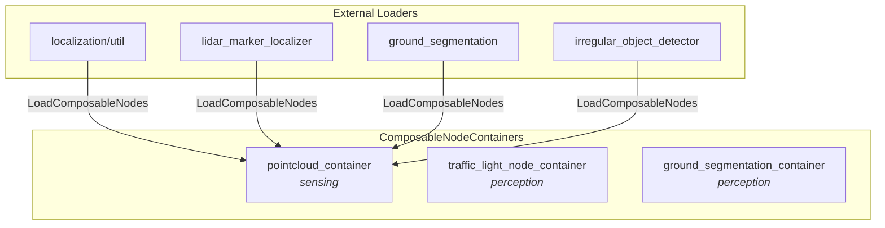

### 2.2 pointcloud_container Components

```mermaid
graph TB
    subgraph pointcloud_container["pointcloud_container (sensing)"]
        direction TB

        subgraph core["Core Components (sensor_kit)"]
            SYNC[PointCloudDataSynchronizerComponent]
            CONCAT[PointCloudConcatenationComponent]
            CROP_CORE[CropBoxFilterComponent]
            DISTORT[DistortionCorrectorComponent]
            RING[RingOutlierFilterComponent]
        end

        subgraph localization_util["Loaded by: localization/util.launch.xml"]
            CROP_MEAS[CropBoxFilterComponent<br/>crop_box_filter_measurement_range]
            VOXEL[VoxelGridDownsampleFilterComponent<br/>voxel_grid_downsample_filter]
            RANDOM[RandomDownsampleFilterComponent<br/>random_downsample_filter]
        end

        subgraph lidar_marker["Loaded by: lidar_marker_localizer.launch.xml"]
            CROP_MARKER[CropBoxFilterComponent<br/>crop_box_filter_measurement_range]
            PASS[PassThroughFilterUInt16Component<br/>ring_filter]
        end

        subgraph ground_seg["Loaded by: ground_segmentation.launch.py"]
            SCAN_GND[ScanGroundFilterComponent]
            CROP_GND[CropBoxFilterComponent]
            CONCAT_GND[PointCloudConcatenateDataSynchronizerComponent]
        end
    end

    SYNC --> CONCAT
    CONCAT --> CROP_CORE
    CROP_CORE --> DISTORT
    DISTORT --> RING

    CROP_MEAS --> VOXEL
    VOXEL --> RANDOM

    CROP_MARKER --> PASS
```

### 2.3 traffic_light_node_container Components

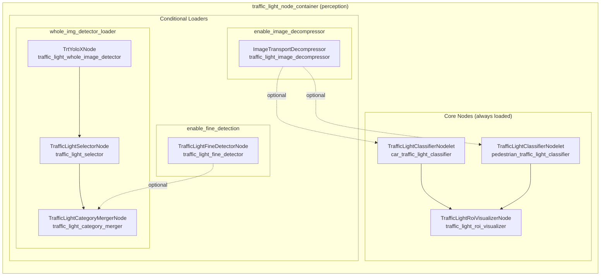

---

## 3. Data Flow Through Containers

### 3.1 Pointcloud Processing Pipeline

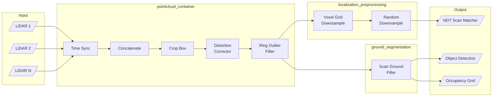

### 3.2 Object Detection Pipeline (Radar)

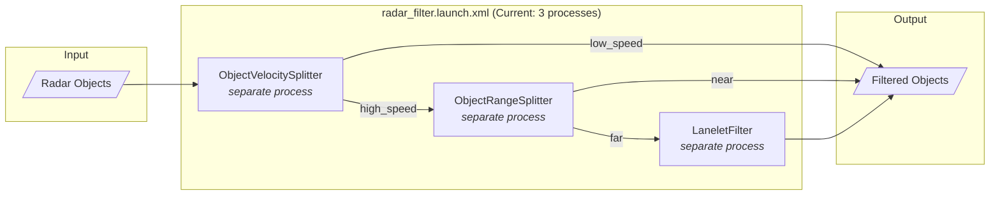

---

## 4. Container Consolidation Opportunities

### 4.1 Current State vs Proposed State

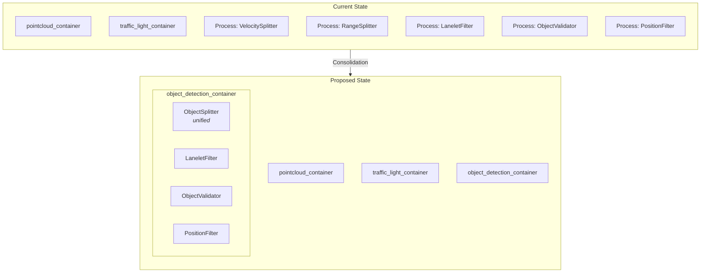

### 4.2 Process Count Comparison

| Module | Current Processes | Proposed Processes | Reduction |
|--------|------------------|-------------------|-----------|
| Radar Filter Pipeline | 3 | 1 | 66% |
| Object Validation | 2-3 | 1 | 50-66% |
| Ground Segmentation | 1 (container) | 1 (container) | - |
| Traffic Light | 1 (container) | 1 (container) | - |

---

## 5. Key File Locations

### Launch Files

| Package | Path |
|---------|------|
| autoware_launch | `/home/yutakakondo/src/autoware/src/launcher/autoware_launch/autoware_launch/launch/` |
| tier4_perception_launch | `launch/tier4_perception_launch/launch/` |
| tier4_localization_launch | `launch/tier4_localization_launch/launch/` |
| tier4_sensing_launch | `launch/tier4_sensing_launch/launch/` |

### Key Container Definitions

| Container | Defined In |
|-----------|------------|
| pointcloud_container | Sensor kit packages (e.g., sample_sensor_kit_launch) |
| traffic_light_node_container | `tier4_perception_launch/launch/traffic_light_recognition/traffic_light_node_container.launch.py` |
| ground_segmentation components | `tier4_perception_launch/launch/obstacle_segmentation/ground_segmentation/ground_segmentation.launch.py` |

### Reference Patterns (Dual-Mode Launch)

- `perception/autoware_ground_segmentation/launch/scan_ground_filter.launch.py` - Standalone OR load into external container pattern

---

## 6. Launch Arguments Flow

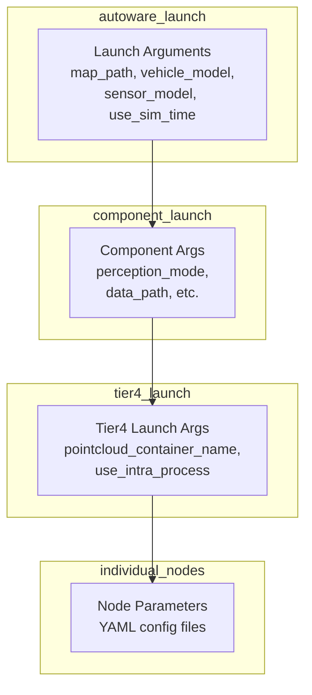
