# Autoware Launch Architecture

本ドキュメントはAutoware Universeにおけるlaunchファイルの階層構造とComposableNodeContainerの関係を説明する。

---

## 1. Launch File Hierarchy

### 1.1 Top-Level Overview

Autowareの起動は`autoware.launch.xml`をエントリーポイントとして、各コンポーネントのlaunchファイルを呼び出す3層構造になっている。

- **Layer 1**: `autoware_launch` - ユーザー向けのトップレベルlaunchファイル
- **Layer 2**: `tier4_*_component` - autoware_launch内のコンポーネント別ラッパー
- **Layer 3**: `tier4_*_launch` - autoware_universe内の実際のlaunchパッケージ

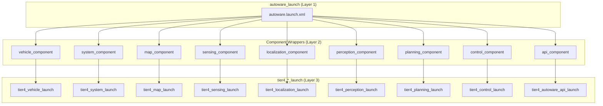

各コンポーネントは`launch_*`フラグ（例: `launch_perception=true`）で起動を制御できる。

---

### 1.2 Perception Launch Hierarchy

Perceptionモジュールは最も複雑な階層構造を持ち、以下の4つの主要サブシステムで構成される：

1. **obstacle_segmentation** - 地面分離と障害物点群抽出
2. **occupancy_grid_map** - 占有格子地図生成
3. **object_recognition** - 物体検出・追跡・予測
4. **traffic_light_recognition** - 信号機認識

#### 1.2.1 Perception Main Structure

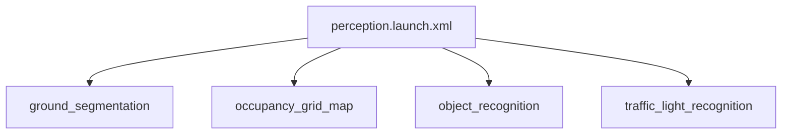

#### 1.2.2 Object Recognition - Detection

物体検出は複数のDetector、Filter、Mergerで構成される。`perception_mode`パラメータにより、使用するDetectorの組み合わせが決まる。

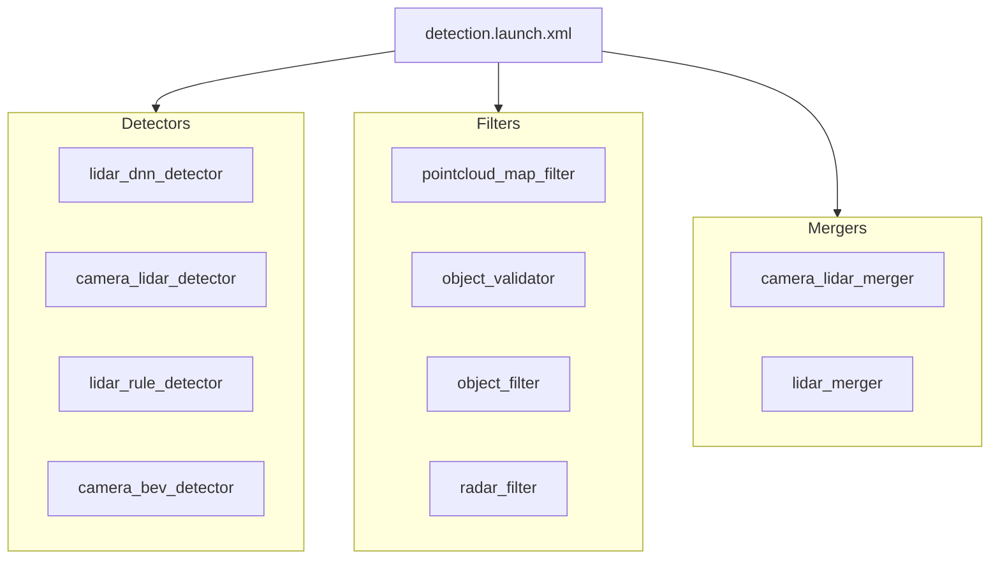

#### 1.2.3 Traffic Light Recognition

信号機認識は専用のComposableNodeContainer（`traffic_light_node_container`）を使用する。

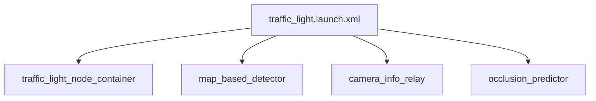

---

### 1.3 Localization Launch Hierarchy

Localizationは複数の自己位置推定手法をサポートしており、`pose_source`と`twist_source`パラメータで選択する。

- **pose_source**: `ndt`, `yabloc`, `eagleye`, `artag`, `lidar-marker`（複数選択可、アンダースコア区切り）
- **twist_source**: `gyro_odom`, `eagleye`

#### 1.3.1 Localization Main Structure

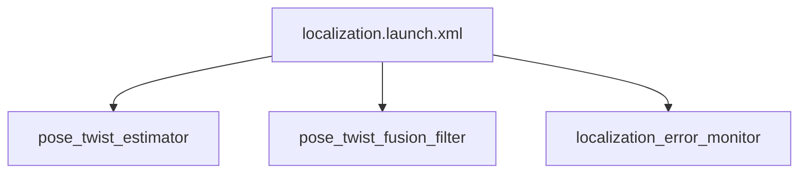

#### 1.3.2 Pose/Twist Estimator Options

各推定手法は条件付きで起動される。複数手法を選択した場合は`pose_estimator_arbiter`が調停を行う。

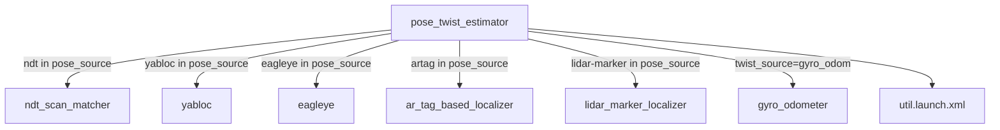

---

### 1.4 Sensing Launch Hierarchy

Sensingは`sensor_model`パラメータで指定されたセンサーキットパッケージに処理を委譲する。
センサーキットパッケージが`pointcloud_container`（ComposableNodeContainer）を作成し、各種フィルタをロードする。

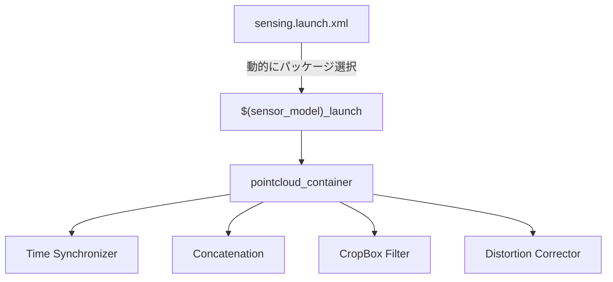

---

## 2. ComposableNodeContainer Relationships

### 2.1 Container Overview

Autowareでは主に以下のComposableNodeContainerが使用される。複数のlaunchファイルが`LoadComposableNodes`を使って同一コンテナにノードをロードすることで、プロセス間通信（IPC）を削減している。

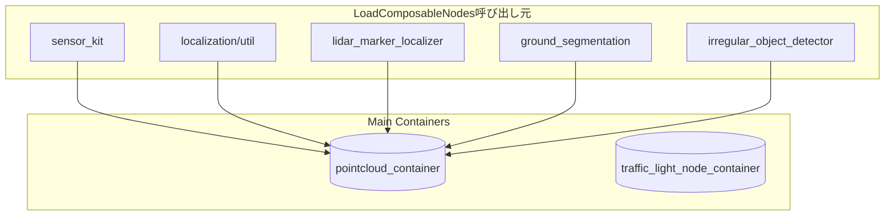

**重要**: `pointcloud_container`は複数のモジュール（sensing, localization, perception）から共有されており、intra-process通信によりゼロコピーでデータを受け渡す。

---

### 2.2 pointcloud_container Components

`pointcloud_container`には複数のlaunchファイルからComposableNodeがロードされる。

#### 2.2.1 Core Components (sensor_kit)

センサーキットパッケージで作成される基本的な点群処理パイプライン。

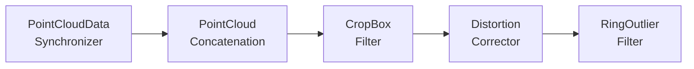

#### 2.2.2 Localization Preprocessing (util.launch.xml)

NDT Scan Matcher用のダウンサンプリング処理。点群数を削減して自己位置推定の計算負荷を軽減する。

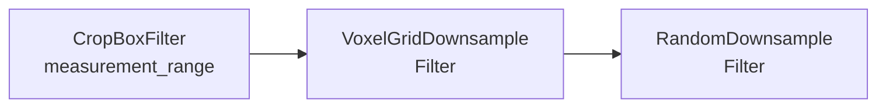

#### 2.2.3 LiDAR Marker Localizer (lidar_marker_localizer.launch.xml)

反射マーカーによる自己位置推定用の前処理。

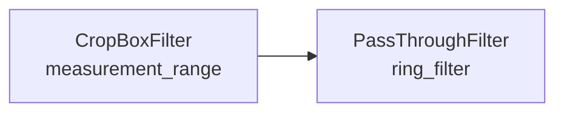

#### 2.2.4 Ground Segmentation (ground_segmentation.launch.py)

地面点群の分離処理。障害物検出とOccupancy Grid Map生成に使用される。

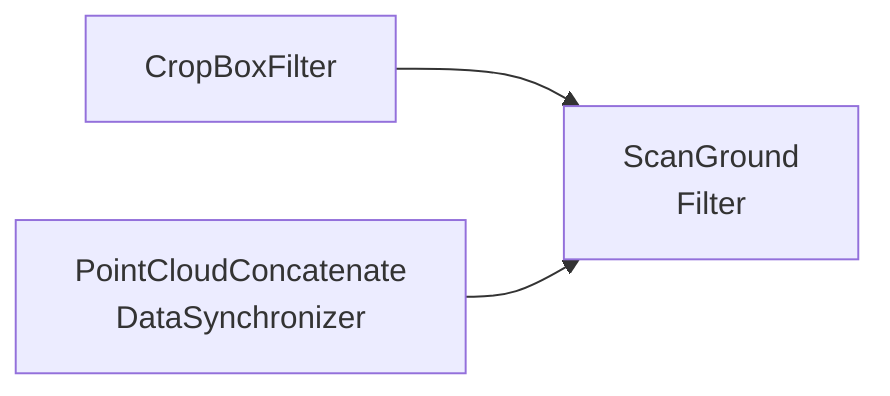

#### 2.2.5 Container Loading Summary

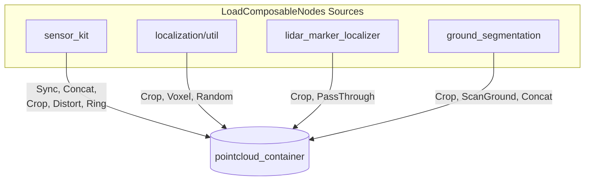

---

### 2.3 traffic_light_node_container Components

信号機認識専用のコンテナ。カメラごとにインスタンスが作成される。

#### 2.3.1 Core Nodes (常にロード)

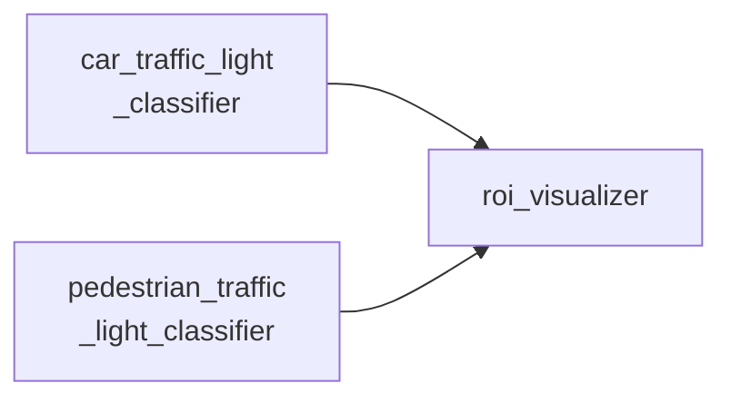

#### 2.3.2 Conditional Nodes (オプション)

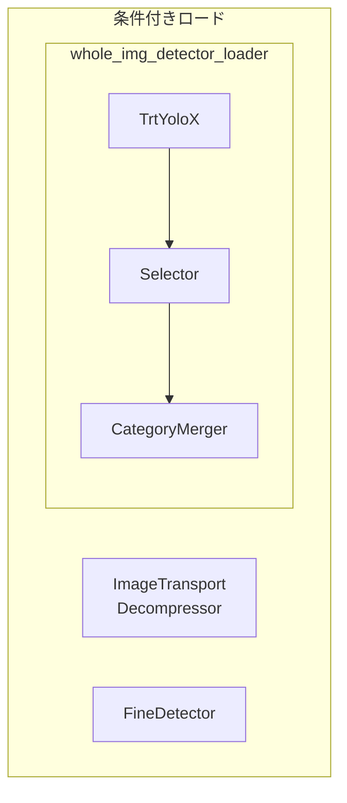

**条件**:
- `enable_image_decompressor=true` → Decompressorをロード
- `enable_fine_detection=true` → FineDetectorをロード

---

## 3. Data Flow Through Containers

### 3.1 Pointcloud Processing Pipeline

複数のLiDARからの点群が統合され、各サブシステムへ分岐する。

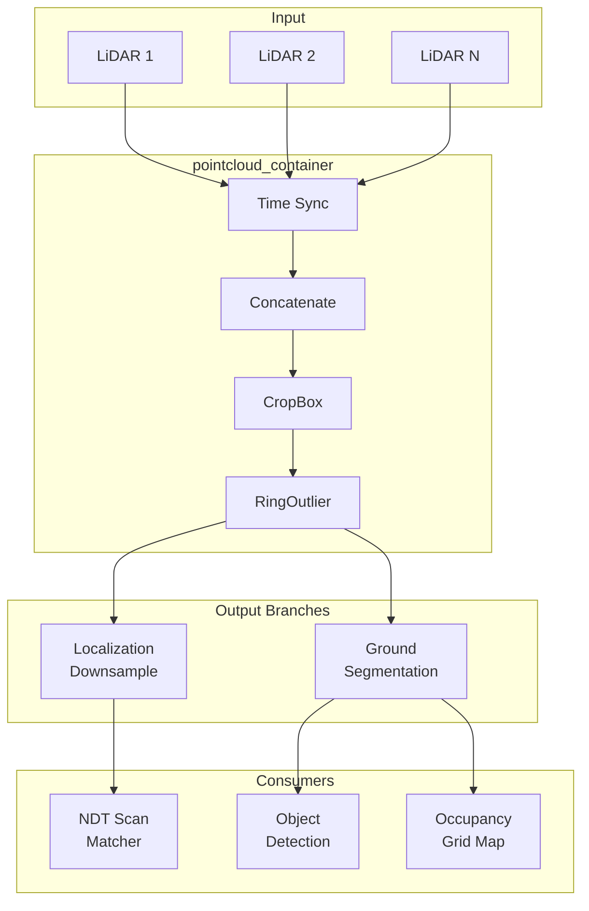

---

### 3.2 Object Detection Pipeline (Radar)

現在のradar_filter.launch.xmlでは、3つの独立プロセスが直列に接続されている。これはIssue #11738で指摘されているアンチパターンの例。

```mermaid
graph LR
    RADAR[/Radar<br/>Objects/]

    VEL[Velocity<br/>Splitter]
    RANGE[Range<br/>Splitter]
    LANE[Lanelet<br/>Filter]

    OUT[/Filtered<br/>Objects/]

    RADAR --> VEL
    VEL -->|high_speed| RANGE
    VEL -->|low_speed| OUT
    RANGE -->|far| LANE
    RANGE -->|near| OUT
    LANE --> OUT
```

**問題点**: 各ノードが別プロセスとして動作し、IPC通信のオーバーヘッドが発生する。

---

## 4. Container Consolidation Opportunities

### 4.1 Current State vs Proposed State

Issue #11738で提案されているコンテナ統合の概要。

#### Current State (現状)

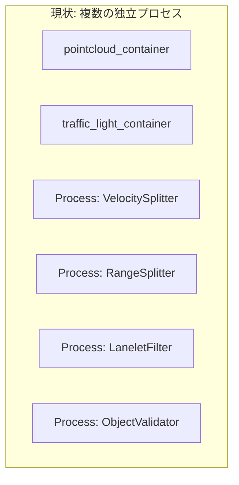

#### Proposed State (提案)

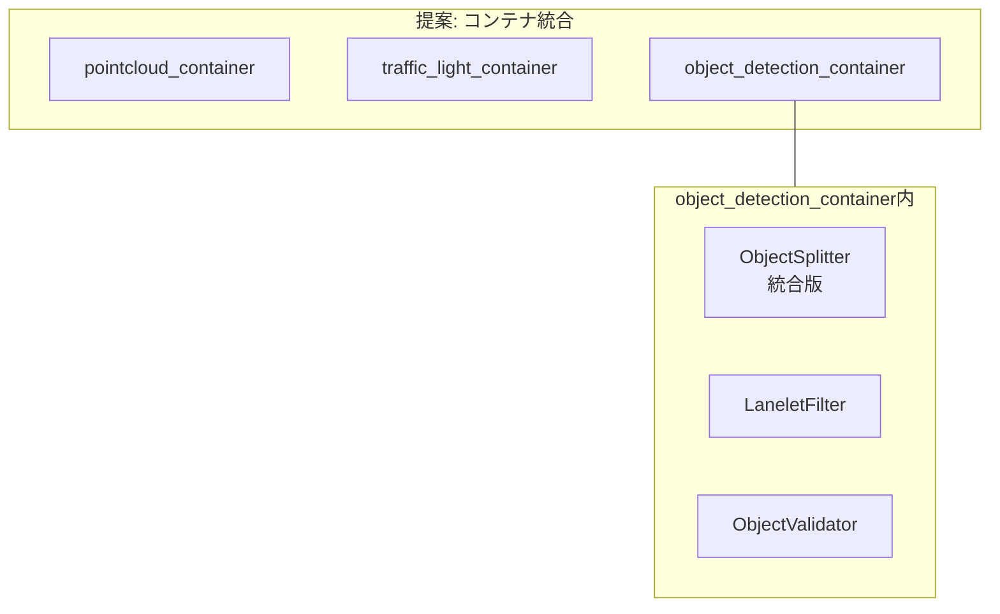

### 4.2 Process Count Comparison

| モジュール | 現状プロセス数 | 提案プロセス数 | 削減率 |
|-----------|--------------|--------------|-------|
| Radar Filter Pipeline | 3 | 1 | 66% |
| Object Validation | 2-3 | 1 | 50-66% |
| Ground Segmentation | 1 (container) | 1 (container) | - |
| Traffic Light | 1 (container) | 1 (container) | - |

### 4.3 Benefits of Consolidation

1. **メモリ削減**: プロセス毎のアドレス空間オーバーヘッドを削減
2. **レイテンシ削減**: IPC通信をintra-process通信（ゼロコピー）に置換
3. **デバッグ容易化**: プロセス数が減り、ログ追跡が簡単に
4. **リソース効率**: スレッドプール共有による効率化

---

## 5. Key File Locations

### 5.1 Launch Files

| パッケージ | パス |
|-----------|------|
| autoware_launch | `autoware_launch/autoware_launch/launch/` |
| tier4_perception_launch | `launch/tier4_perception_launch/launch/` |
| tier4_localization_launch | `launch/tier4_localization_launch/launch/` |
| tier4_sensing_launch | `launch/tier4_sensing_launch/launch/` |

### 5.2 Key Container Definitions

| コンテナ | 定義ファイル |
|---------|------------|
| pointcloud_container | Sensor kit packages (例: sample_sensor_kit_launch) |
| traffic_light_node_container | `tier4_perception_launch/launch/traffic_light_recognition/traffic_light_node_container.launch.py` |

### 5.3 Reference Patterns

**Dual-Mode Launch Pattern** (スタンドアロン または 外部コンテナへロード):
- `perception/autoware_ground_segmentation/launch/scan_ground_filter.launch.py`

このパターンは`container`引数が空の場合は独自コンテナを作成し、指定がある場合は`LoadComposableNodes`で外部コンテナにロードする。

---

## 6. Launch Arguments Flow

Launch引数はトップレベルから各ノードのパラメータまで階層的に伝播する。

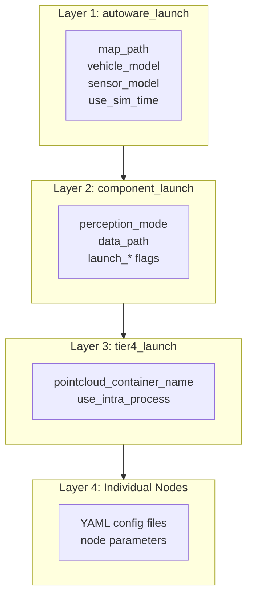

---

## 7. Related Documents

- [Issue #11738: Node/Callback Explosion Anti-pattern](https://github.com/autowarefoundation/autoware.universe/issues/11738)
- [Anti-pattern Analysis Report](../.claude/anti-pattern-analysis-report.md)
- [Callback Reduction Design Plan](../.claude/plans/wise-noodling-cascade.md)
