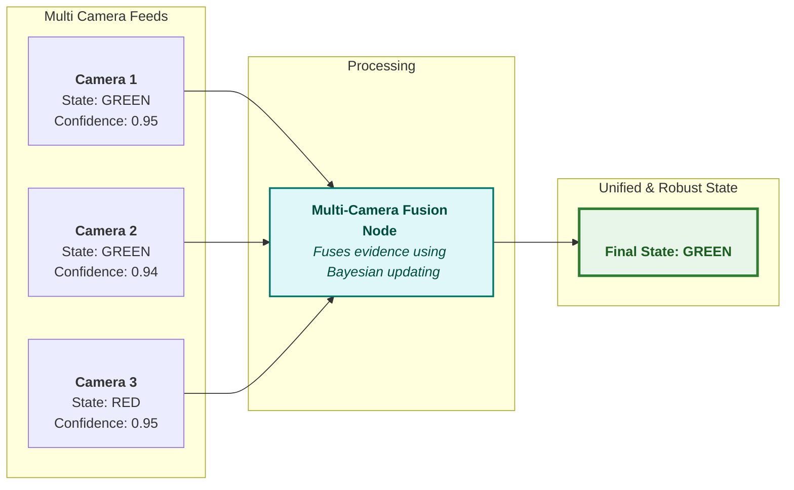
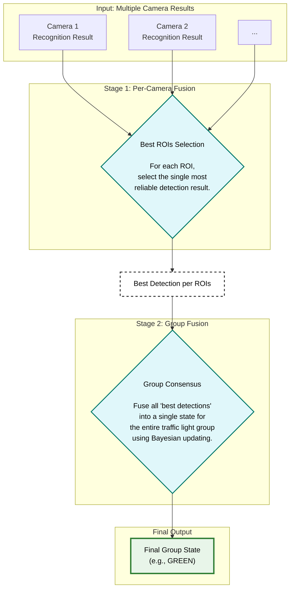

# autoware_traffic_light_multi_camera_fusion

## Overview

This node fuses traffic light recognition results from multiple cameras to produce a single, reliable traffic light state. By integrating information from different viewpoints and ROIs, it ensures robust performance even in challenging scenarios, such as partial **occlusions** or recognition errors from an individual camera.

---

## How It Works

The fusion algorithm operates in two main stages.

### Stage 1: Best View Selection (Per-Camera Fusion)

First, for each individual ROIs, the node selects the single most reliable detection—the "best shot"—from all available camera views.

This selection is based on a strict priority queue:

- **Latest Timestamp:** Detections with the most recent timestamp are prioritized for the same sensor.
- **Known State:** Results with a known color (Red, Green, etc.) are prioritized over 'Unknown'.
- **Full Visibility:** Detections from non-truncated ROIs (fully visible ROIs) are prioritized.
- **Highest Confidence:** The result with the highest detection confidence score is prioritized.

This process yields the single most plausible recognition for every ROIs.

### Stage 2: Group Consensus (Bayesian Fusion)

Next, the "best shot" detections from Stage 1 are fused to determine a single, coherent state for the entire traffic light group. Instead of simple voting or averaging, this node employs a more principled method: **Bayesian updating**.

- **Belief Score:** Each color (Red, Green, Yellow) maintains a "belief score" represented in **log-odds** for numerical stability and ease of updating.
- **Evidence Update:** Each selected detection from Stage 1 is treated as a piece of "evidence." Its confidence score is converted into a log-odds value representing the strength of that evidence.
- **Score Accumulation:** This evidence is **added** to the corresponding color's belief score.
- **Final Decision:** After accumulating all evidence, the color with the highest final score is chosen as the definitive state for the group.

## Cross Camera Validation

This node includes an option to compare and validate detected traffic light signals within the same regulatory element.

Setting `signal_consistency_check.enable` to true activates this validation. When enabled, the node compares traffic light signals across traffic light signals; if a conflict is detected, it uses a fail-safe signal instead of the conflicting input.

If `signal_consistency_check.publish_partial_matched_signal` is set to true, the node will publish the signal that is common to all sources when conflicts occur.

### Example

Inputs:

- Traffic light A: {(RED, CIRCLE), (GREEN, LEFT_ARROW)} with confidence 0.99
- Traffic light B: {(RED, CIRCLE)} with confidence 0.8

The validated output is shown in the following table:

| signal_consistency_check | publish_partial_matched_signal | output                                                       |
| ------------------------ | ------------------------------ | ------------------------------------------------------------ |
| Disabled                 | Disabled                       | `(RED, CIRCLE)`, `(GREEN, LEFT_ARROW)`: most probable signal |
| Enabled                  | Disabled                       | `(UNKNOWN, UNKNOWN)`: fail-safe signal                       |
| Enabled                  | Enabled                        | `(RED, CIRCLE)`: common signal                               |

## Map-based Signal Filter

The node includes an optional rule-based filter that constrains ML predictions to the (color, shape) combinations declared on each traffic light's `light_bulbs` linestring in the vector map.

Setting `map_based_signal_filter.enable` to true activates the filter. When active, for each traffic light the node reads the map's `light_bulbs` points (their `color` and optional `arrow` attributes) and builds a per-traffic-light-id set of allowed (color, shape) pairs. Any incoming ML prediction whose (color, shape) is not in that set is dropped as soon as it arrives, so a map-invalid prediction cannot beat a valid one from another camera.

If every element of a signal is filtered out, that signal becomes an UNKNOWN fail-safe. If the map has no `light_bulbs` for a given traffic light id, the filter is a no-op for that id — we cannot filter what the map does not describe.

The vector map is always subscribed (the node needs it to map traffic-light-ids to regulatory-element-ids); the `enable` flag only controls whether the filter runs.

> **NOTE:** The correctness of this filter depends **entirely on the quality of the vector map**. If a traffic light's `light_bulbs` in the map is incomplete or wrong (e.g. an arrow bulb is missing, or `color`/`arrow` attributes are stale), the filter will incorrectly reject valid ML predictions and the node will publish UNKNOWN for that light. Before enabling this option, verify that every relevant traffic light in your map has accurate `light_bulbs` points with correct `color` and `arrow` attributes.

### Example

Map for traffic light A declares bulbs: `{(red, circle), (yellow, circle), (green, circle)}` — no arrows.

Inputs:

- Traffic light A: `{(RED, CIRCLE), (GREEN, LEFT_ARROW)}` from ML

| map_based_signal_filter.enable | output                                                      |
| ------------------------------ | ----------------------------------------------------------- |
| Disabled                       | `(RED, CIRCLE)`, `(GREEN, LEFT_ARROW)`: raw ML prediction   |
| Enabled                        | `(RED, CIRCLE)`: arrow dropped because the map disallows it |

## Input topics

For every camera, the following three topics are subscribed:

| Name                                                  | Type                                             | Description                           |
| ----------------------------------------------------- | ------------------------------------------------ | ------------------------------------- |
| `~/<camera_namespace>/camera_info`                    | sensor_msgs::msg::CameraInfo                     | camera info from map_based_detector   |
| `~/<camera_namespace>/detection/rois`                 | tier4_perception_msgs::msg::TrafficLightRoiArray | detection roi from fine_detector      |
| `~/<camera_namespace>/classification/traffic_signals` | tier4_perception_msgs::msg::TrafficLightArray    | classification result from classifier |

You don't need to configure these topics manually. Just provide the `camera_namespaces` parameter and the node will automatically extract the `<camera_namespace>` and create the subscribers.

## Output topics

| Name                       | Type                                                  | Description                        |
| -------------------------- | ----------------------------------------------------- | ---------------------------------- |
| `~/output/traffic_signals` | autoware_perception_msgs::msg::TrafficLightGroupArray | traffic light signal fusion result |

## Node parameters

{{ json_to_markdown("perception/autoware_traffic_light_multi_camera_fusion/schema/traffic_light_multi_camera_fusion.schema.json") }}
