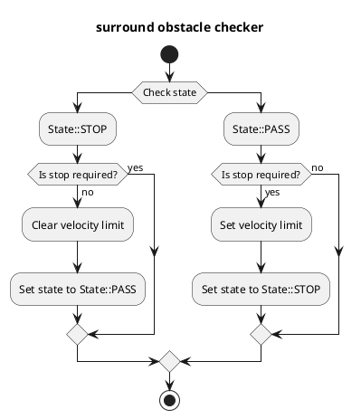

# Surround Obstacle Checker

## Purpose

This module subscribes required data (ego-pose, obstacles, etc), and publishes zero velocity limit to keep stopping if any of stop conditions are satisfied.

## Inner-workings / Algorithms

### Flow chart

  

### Algorithms

### Check data

Check that `surround_obstacle_checker` receives the obstacle grid, dynamic objects and current velocity data.

### Get distance to nearest object

Calculate distance between ego vehicle and the nearest object.
For the pointcloud check this is the minimum distance between the ego footprint polygon and the nearest qualifying cell of the obstacle grid (`grid_map_msgs/GridMap`, `base_link`, from `autoware_obstacle_grid_extractor`); for dynamic objects it is the minimum distance between the ego footprint and each object polygon. A grid cell qualifies as soon as it holds any return (`point_count >= 1`); the check is purely 2D, so cell height is not gated. The reported nearest point is the winning cell center with `z = 0.0` (honest 2D evidence; a cell has no single height).

Because the grid is a `base_link`-relative product with a bounded region of interest (ROI), the pointcloud check covers only obstacles inside that ROI. With the extractor's default ROI (`length_x`/`length_y`/`offset_x` = 60/40/20 m, i.e. `x ∈ [-10, 50]`, `y ∈ [-20, 20]` in `base_link`) the shipped default margins fit with ample headroom (~8.4 m of rear clearance). A `surround_check_back_distance` (or front/side) tuned beyond the ROI edge would silently lose coverage there; such a configuration requires a correspondingly widened extractor ROI (`roi.length_x`/`roi.length_y`/`roi.offset_x`).

### Stop requirement

If it satisfies all following conditions, it plans stopping.

- Ego vehicle is stopped
- It satisfies any following conditions
  1. The distance to nearest obstacle satisfies following conditions
     - If state is `State::PASS`, the distance is less than `surround_check_distance`
     - If state is `State::STOP`, the distance is less than `surround_check_recover_distance`
  2. If it does not satisfies the condition in 1, elapsed time from the time it satisfies the condition in 1 is less than `state_clear_time`

### States

To prevent chattering, `surround_obstacle_checker` manages two states.
As mentioned in stop condition section, it prevents chattering by changing threshold to find surround obstacle depending on the states.

- `State::PASS` : Stop planning is released
- `State::STOP` ：While stop planning

## Inputs / Outputs

### Input

| Name                                           | Type                                              | Description                                                                       |
| ---------------------------------------------- | ------------------------------------------------- | --------------------------------------------------------------------------------- |
| `/sensing/obstacle_segmentation/obstacle_grid` | `grid_map_msgs::msg::GridMap`                     | Obstacle grid (`base_link`, layers `point_count`/`max_height`) from the extractor |
| `/perception/object_recognition/objects`       | `autoware_perception_msgs::msg::PredictedObjects` | Dynamic objects                                                                   |
| `/localization/kinematic_state`                | `nav_msgs::msg::Odometry`                         | Current twist                                                                     |

### Output

| Name                                    | Type                                                              | Description                                                                           |
| --------------------------------------- | ----------------------------------------------------------------- | ------------------------------------------------------------------------------------- |
| `~/output/velocity_limit_clear_command` | `autoware_internal_planning_msgs::msg::VelocityLimitClearCommand` | Velocity limit clear command                                                          |
| `~/output/max_velocity`                 | `autoware_internal_planning_msgs::msg::VelocityLimit`             | Velocity limit command                                                                |
| `~/output/no_start_reason`              | `diagnostic_msgs::msg::DiagnosticStatus`                          | No start reason                                                                       |
| `~/debug/marker`                        | `visualization_msgs::msg::MarkerArray`                            | Marker for visualization                                                              |
| `~/debug/footprint`                     | `geometry_msgs::msg::PolygonStamped`                              | Ego vehicle base footprint for visualization                                          |
| `~/debug/footprint_offset`              | `geometry_msgs::msg::PolygonStamped`                              | Ego vehicle footprint with `surround_check_distance` offset for visualization         |
| `~/debug/footprint_recover_offset`      | `geometry_msgs::msg::PolygonStamped`                              | Ego vehicle footprint with `surround_check_recover_distance` offset for visualization |

## Parameters

{{ json_to_markdown("planning/autoware_surround_obstacle_checker/schema/surround_obstacle_checker.schema.json") }}

| Name                                   | Type     | Description                                                                                                                                      | Default value                            |
| :------------------------------------- | :------- | :----------------------------------------------------------------------------------------------------------------------------------------------- | :--------------------------------------- |
| `enable_check`                         | `bool`   | Indicates whether each object is considered in the obstacle check target.                                                                        | `true` for objects; `false` for the grid |
| `pointcloud.obstacle_grid_timeout_sec` | `double` | Staleness watchdog for the obstacle grid [s]; a grid older than this is treated as unavailable (fail-safe), never as clear.                      | 0.5                                      |
| `surround_check_front_distance`        | `bool`   | If there are objects or grid cells within this distance in front, transition to the "exist-surrounding-obstacle" status [m].                     | 0.5                                      |
| `surround_check_side_distance`         | `double` | If there are objects or point clouds within this side distance, transition to the "exist-surrounding-obstacle" status [m].                       | 0.5                                      |
| `surround_check_back_distance`         | `double` | If there are objects or point clouds within this back distance, transition to the "exist-surrounding-obstacle" status [m].                       | 0.5                                      |
| `surround_check_hysteresis_distance`   | `double` | If no object exists within `surround_check_xxx_distance` plus this additional distance, transition to the "non-surrounding-obstacle" status [m]. | 0.3                                      |
| `state_clear_time`                     | `double` | Threshold to clear stop state [s]                                                                                                                | 2.0                                      |
| `stop_state_ego_speed`                 | `double` | Threshold to check ego vehicle stopped [m/s]                                                                                                     | 0.1                                      |
| `stop_state_entry_duration_time`       | `double` | Threshold to check ego vehicle stopped [s]                                                                                                       | 0.1                                      |
| `publish_debug_footprints`             | `bool`   | Publish vehicle footprint with/without offsets                                                                                                   | `true`                                   |

## Assumptions / Known limits

To perform stop planning, it is necessary to get the obstacle grid data.
Hence, it does not plan stopping if the obstacle is in a blind spot or outside the extractor ROI.

While the pointcloud check is enabled, a grid that is stale (older than `pointcloud.obstacle_grid_timeout_sec`), in the wrong frame, missing a required layer, unconvertible, or not yet received is treated as **unavailable**, never as "clear". Being a no-start guard, a latched stop is **held** rather than released on such an unavailable grid; a fresh valid grid restores normal hysteresis-based clearing. (The all-NaN "alive" heartbeat grid is a valid, fresh grid reporting no obstacle, so it clears normally.)

Dynamic object labels supported by this node are:
`unknown`, `car`, `truck`, `bus`, `trailer`, `motorcycle`, `bicycle`, `pedestrian`, `animal`, `hazard`, `over_drivable`, and `under_drivable`.

The default config enables checks for `animal` and `hazard`, and disables them for `over_drivable` and `under_drivable`.
