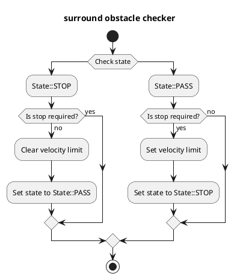

# Surround Obstacle Checker

## Purpose

`surround_obstacle_checker` は、自車が停車中、自車の周囲に障害物が存在する場合に発進しないように停止計画を行うモジュールである。

## Inner-workings / Algorithms

### Flow chart

  

### Algorithms

### Check data

障害物グリッド、動的物体、自車速度のデータが取得できているかどうかを確認する。

### Get distance to nearest object

自車と最近傍の障害物との距離を計算する。
点群チェックでは、自車のポリゴンと障害物グリッド（`grid_map_msgs/GridMap`、`base_link`、`autoware_obstacle_grid_extractor` が生成）の最近傍の該当セルとの距離を求める。動的物体では、自車のポリゴンと各動的物体のポリゴンとの距離を求める。セルは何らかの点を含んだ時点（`point_count >= 1`）で該当とみなし、チェックは純粋に 2D であるためセルの高さはゲートしない。報告される最近傍点は該当セルの中心で `z = 0.0`（セルは単一の高さを持たないため 2D の情報として扱う）。

グリッドは `base_link` 相対で有限の関心領域（ROI）を持つ製品であるため、点群チェックは ROI 内の障害物のみを対象とする。ROI 外の障害物には停止計画を行わない。

### Stop condition

次の条件をすべて満たすとき、自車は停止計画を行う。

- 自車が停車していること
- 次のうちいずれかを満たすこと
  1. 最近傍の障害物との距離が次の条件をみたすこと
     - `State::PASS` のとき、`surround_check_distance` 未満である
     - `State::STOP` のとき、`surround_check_recover_distance` 以下である
  2. 1 を満たしていないとき、1 の条件を満たした時刻からの経過時間が `state_clear_time` 以下であること

### States

チャタリング防止のため、`surround_obstacle_checker` では状態を管理している。
Stop condition の項で述べたように、状態によって障害物判定のしきい値を変更することでチャタリングを防止している。

- `State::PASS` ：停止計画解除中
- `State::STOP` ：停止計画中

## Inputs / Outputs

### Input

| Name                                           | Type                                              | Description                                                                       |
| ---------------------------------------------- | ------------------------------------------------- | --------------------------------------------------------------------------------- |
| `/sensing/obstacle_segmentation/obstacle_grid` | `grid_map_msgs::msg::GridMap`                     | Obstacle grid (`base_link`, layers `point_count`/`max_height`) from the extractor |
| `/perception/object_recognition/objects`       | `autoware_perception_msgs::msg::PredictedObjects` | Dynamic objects                                                                   |
| `/localization/kinematic_state`                | `nav_msgs::msg::Odometry`                         | Current twist                                                                     |

### Output

| Name                                    | Type                                                              | Description                  |
| --------------------------------------- | ----------------------------------------------------------------- | ---------------------------- |
| `~/output/velocity_limit_clear_command` | `autoware_internal_planning_msgs::msg::VelocityLimitClearCommand` | Velocity limit clear command |
| `~/output/max_velocity`                 | `autoware_internal_planning_msgs::msg::VelocityLimit`             | Velocity limit command       |
| `~/output/no_start_reason`              | `diagnostic_msgs::msg::DiagnosticStatus`                          | No start reason              |
| `~/debug/marker`                        | `visualization_msgs::msg::MarkerArray`                            | Marker for visualization     |

## Parameters

| Name                              | Type     | Description                                                                            | Default value |
| :-------------------------------- | :------- | :------------------------------------------------------------------------------------- | :------------ |
| `use_pointcloud`                  | `bool`   | Use pointcloud as obstacle check                                                       | `true`        |
| `use_dynamic_object`              | `bool`   | Use dynamic object as obstacle check                                                   | `true`        |
| `surround_check_distance`         | `double` | If objects exist in this distance, transit to "exist-surrounding-obstacle" status [m]  | 0.5           |
| `surround_check_recover_distance` | `double` | If no object exists in this distance, transit to "non-surrounding-obstacle" status [m] | 0.8           |
| `state_clear_time`                | `double` | Threshold to clear stop state [s]                                                      | 2.0           |
| `stop_state_ego_speed`            | `double` | Threshold to check ego vehicle stopped [m/s]                                           | 0.1           |
| `stop_state_entry_duration_time`  | `double` | Threshold to check ego vehicle stopped [s]                                             | 0.1           |

## Assumptions / Known limits

この機能が動作するためには障害物グリッドの観測が必要なため、障害物が死角または抽出器の ROI 外にある場合は停止計画を行わない。
